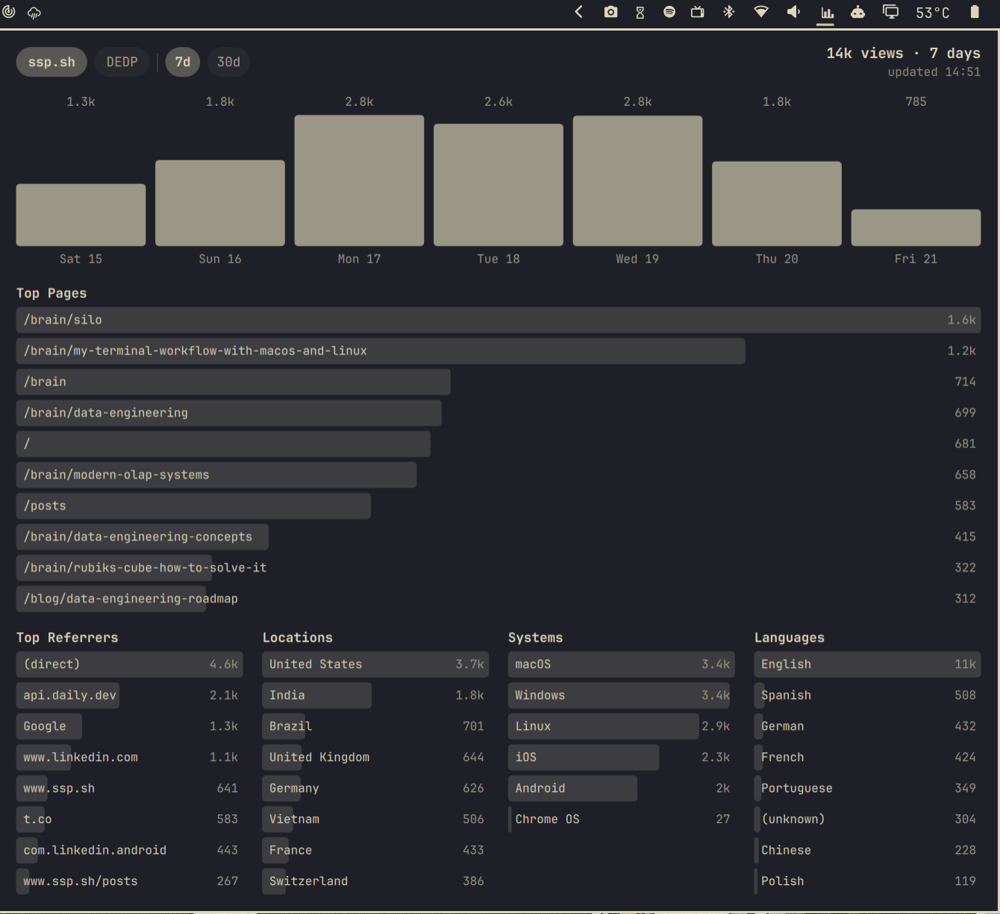
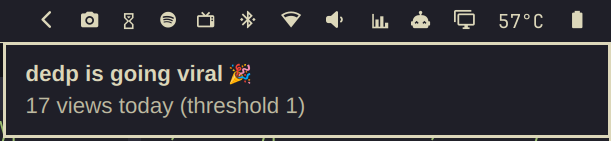

# Omarchy GoatCounter Plugin

https://github.com/user-attachments/assets/72a461a7-4653-4253-9a78-d0c52d01c37b

[GoatCounter](https://www.goatcounter.com/) analytics in the Omarchy bar: a
chart icon that expands to your weekly totals on hover, and a popup with a
7-day or 30-day pageview bar chart, top pages, and top referrers, locations,
systems, and languages. Supports any number of sites with a tab switcher,
plus optional "going viral" notifications.

Stats are fetched in the background every 15 minutes and cached on disk, so
opening the panel is always instant.

Left Mouse Click Preview:


Hover Preview:


Viral notification:



## Setup

### 1. Create an API token

For each site, go to `https://<your-site>/user/api` (Settings → API) and
create a token with the **Read statistics** permission.

### 2. Add credentials to your secrets file

Credentials stay out of the dotfiles repo. Add to your secrets file
(default: `~/.dotfiles/zsh/.secrets`, override with the
`GOATCOUNTER_SECRETS` environment variable):

```sh
export GOATCOUNTER_URL="https://goatcounter.example.com"
export GOATCOUNTER_TOKEN="..."

# Any number of additional sites, one _<NAME> suffix pair each:
export GOATCOUNTER_URL_BLOG="https://blog.goatcounter.com"
export GOATCOUNTER_TOKEN_BLOG="..."
```

Sites are auto-discovered from these pairs — no plugin config needed. The
fetch script evals only the `GOATCOUNTER_*` assignment lines from that file,
never the whole file, and never prints tokens.

### 3. Install

```sh
DEST=~/.config/omarchy/plugins/sspaeti.goatcounter
mkdir -p "$DEST"
cp manifest.json BarWidget.qml Panel.qml Model.js fetch.sh LICENSE "$DEST"/
sed -i 's/io\.github\.sspaeti\.goatcounter/sspaeti.goatcounter/g' \
  "$DEST"/manifest.json "$DEST"/BarWidget.qml "$DEST"/Panel.qml
chmod +x "$DEST"/fetch.sh
```

Then add it to the bar in `~/.config/omarchy/shell.json`:

```json
{ "id": "sspaeti.goatcounter" }
```

## Usage

- **Hover** the bar icon: weekly totals for all sites ("ssp.sh 14k · blog 456")
- **Left click**: open the stats panel; click the tabs to switch sites and
  the `7d` / `30d` pills to switch the time range
- **Middle click**: force a refresh
- **Right click**: open the active site's GoatCounter dashboard in the browser

IPC: `omarchy-shell shell toggle sspaeti.goatcounter` — bind it in
Hyprland, e.g. `o.bind("SUPER + CTRL + G", "GoatCounter stats", "omarchy-shell shell toggle sspaeti.goatcounter")`.

## Settings

All optional, on the widget entry in `shell.json`:

| Setting | Default | Description |
|---------|---------|-------------|
| `icon` | `󰄨` | Bar icon |
| `hoverExpand` | `true` | Expand the pill with weekly totals on hover; `false` keeps it a static icon |
| `defaultDays` | `"7"` | Range shown when the panel opens (`"7"` or `"30"`) |
| `siteLabels` | `{}` | Display-name overrides keyed by the derived label, e.g. `{"blog": "My Blog"}` |
| `alertDailyViews` | `0` (off) | Notify when a site passes this many views today; a number for all sites or a per-site map like `{"ssp.sh": 4000}` |
| `alertHourlyViews` | `0` (off) | Same for views in the last 60 minutes |

Example:

```json
{
  "id": "sspaeti.goatcounter",
  "siteLabels": { "blog": "Blog" },
  "alertHourlyViews": { "ssp.sh": 300, "blog": 50 },
  "alertDailyViews": { "ssp.sh": 4000, "blog": 100 }
}
```

Alerts are checked on every background refresh (15 min) and deduplicated per
day / per hour, so a viral day produces one daily notification and at most
one hourly notification per hour while the spike lasts.

## How it works

`fetch.sh` queries the GoatCounter API: `/api/v0/stats/total` once per day
for the last 30 days (the endpoint has no per-day breakdown; the 7-day view
is the tail of the same series), `/stats/hits` for top pages, and
`/stats/{toprefs,locations,systems,languages}` for the lists — each for both
ranges. Calls are spaced to respect the ~4 req/s rate limit. Date ranges are
sent as full RFC3339 timestamps because date-only ranges return partial
data. The combined JSON is cached at
`~/.local/state/omarchy/goatcounter/stats.json` (mode 600).

The UI only uses theme colors (`bar.foreground`, `Color.accent`, `Style.*`),
so it follows the active Omarchy theme automatically, including live theme
switches.

## License

MIT
